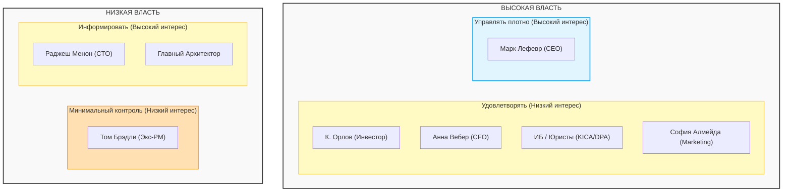

# Карта стейкхолдеров проекта Africa Delivery

## 1. Матрица «Власть / Интерес» (Stakeholder Matrix)

| Стейкхолдер | Власть (Влияние) | Интерес к продукту | Приоритет при конфликте | Предпочтительный способ коммуникации | Ключевой интерес / Ограничение |
| :--- | :--- | :--- | :--- | :--- | :--- |
| **К. Орлов**  (Инвестор) | **Высокая** | **Низкий** | **P0 (Высший)**  Финальный арбитр. | Живой дашборд метрик на телефоне (обновление раз в минуту), еженедельные отчеты. | Главный источник капитала. Требует выполнения бизнес-плана, соблюдения сроков и надежности. В детали разработки и интерфейсов не погружается. |
| **Анна Вебер**  (CFO) | **Высокая** | **Низкий** | **P1**  Прямой представитель капитала. | Ежемесячный финансовый отчет, точечные запросы на согласование бюджетов и эквайринга. | Стоимость приема платежей строго <2,5% от GMV (включая конвертацию). Жесткий лимит бюджета ($5k/мес), отсрочка платежей провайдерам 45 дней. |
| **Марк Лефевр**  (CEO) | **Высокая** | **Высокий** | **P2**  Операционный руководитель. | Стратегические синки по операционным показателям, утверждение этапов (MVP). | Автоматизация рекрутинга — ключ к получению новых клиентов. Запуск строго в срок, капитализация компании. Вовлечен в цели продукта. |
| **Юристы**  (Nwosu & Partners) | **Высокая** | **Низкий** | **P3**  Право регуляторного и технического вето. | Согласование готовых архитектурных комплаенс-решений на ключевых вехах. | Локализация платежных данных строго внутри Кении (KICA, Data Protection Act 2019). Сертификация CNCF. Защита персональных данных (ФЗ/DPA). |
| **София Алмейда**  (Head of Marketing) | **Высокая** | **Низкий** | **P4**  Заказчик маркетинговых ограничений. | Синхронизация дедлайнов по рекламным кампаниям и акциям. | Требования к функционалу в соответствии с маркетинговыми обещаниями. |
| **Раджеш Менон**  (CTO) | **Низкая** | **Высокий** | **P5**  Технический исполнитель. | Технические архитектурные синки, ревью проектных решений, защита коммитов. | Технологический перфекционизм: хочет всё свое в K8s без managed-сервисов (через операторы), СУБД Oracle для ядра, моностек на Go, GitOps на ArgoCD. |
| **Главный Архитектор**   | **Низкая** | **Высокий** | **P6**  Экспертная роль. | Прямая фасилитация со всеми стейкхолдерами, защита ИТ-архитектуры перед CTO и ИБ. | Построение экономически эффективной, законной (Кения DPA) и масштабируемой системы в рамках ограничений (MVP за 4 недели, $5k/мес, 6 человек). |
| **Том Брэдли**  (Экс-Product Manager) | **Низкая** | **Низкий** | **P7 (Низший)**  Влияние отсутствует. | Нет необходимости. | Уволился. Оставил бэклог из 29 невыполненных функций со статусом P0 без реальной приоритизации. |

---

## 2. Диаграмма матрицы стейкхолдеров (PlantUML)

### Диаграмма «Влияние / Интерес» (Матрица Менделоу)

