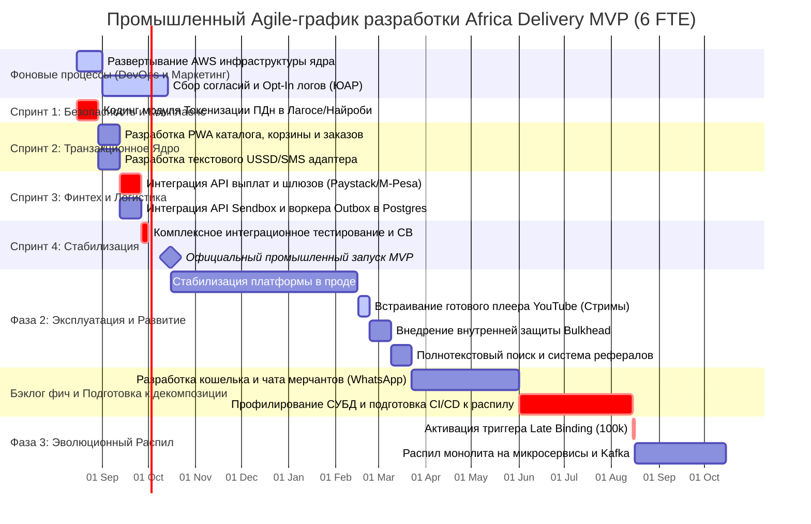

# Дорожная карта технологического развития (Technology Roadmap) — Africa Delivery

Настоящий Roadmap фиксирует этапы эволюции платформы Africa Delivery на горизонте 12 месяцев. Развитие системы строго синхронизировано с бизнес-показателями, объемами транзакционной нагрузки и ограничениями TCO-модели.

## 1. Визуальный таймлайн проекта (Диаграмма Ганта)

---

## 2. Спецификация контрольных точек (Milestones) и спринтов

### 2.1. Период подготовки и комплаенса (До запуска маркетплейса)

#### Фоновые инфраструктурные и маркетинговые процессы (15 августа — 14 октября)
* **Объем работ:** Параллельное автоматизированное развертывание базовой инфраструктуры ядра в AWS (af-south-1) через Terraform-скрипты силами СТО. Одновременный запуск маркетинговых посадочных страниц (лендингов) в ЮАР для непрерывного сбора юридических согласий пользователей и формирования базы Opt-In логов до официального старта продаж.
* **ИТ-инфраструктурная стоимость:** **\$1 500 / мес** (затраты на этапе пусконаладки сетевых IPSec VPN-туннелей и тестирования контуров).

#### Спринт 1: Безопасность и Комплаенс (15 августа — 29 августа)
* **Объем функций (Scope):** Проектирование и кодинг изолированного модуля токенизации ПДн (`Data Residency Router`). Развертывание локальных реляционных СУБД PostgreSQL на арендованных мощностях национальных провайдеров в Нигерии и Кении с настройкой полнодискового шифрования LUKS (AES-256).
* **Команда и ФОТ:** 6 инженеров-контракторов, СТО, Главный Архитектор. ФОТ: \$30 000 / мес.

#### Спринт 2: Транзакционное Ядро (30 августа — 12 сентября)
* **Объем функций (Scope):** Фокус всей команды на разработке базового транзакционного ядра монолита на Go. Сборка легковесного веб-интерфейса PWA для городских пользователей и текстового USSD/SMS адаптера для сельских регионов. Реализация логики корзины и схем данных каталога.

#### Спринт 3: Финтех и Логистика (13 сентября — 26 сентября)
* **Объем функций (Scope):** Интеграция готовых API-интерфейсов платежных агрегаторов Paystack и мобильных денег M-Pesa. Сборка Адаптера логистических систем (`Delivery Gateway Adapter`) с логикой фолнового асинхронного воркера *Transactional Outbox* в PostgreSQL и подстановкой фиксированного тарифа доставки (\$5) при сбоях API Sendbox.

#### Спринт 4: Стабилизация и запуск MVP (27 сентября — 15 октября)
* **Объем функций (Scope):** Полное замораживание написания нового кода. Проведение сквозного интеграционного тестирования, симуляция аварийных сценариев для верификации паттернов *Circuit Breaker* и *Bulkhead*. **15 октября — Официальный промышленный запуск маркетплейса Africa Delivery MVP**.
* **ИТ-инфраструктурная стоимость в Прод-режиме:** **\$4 916 / мес** (В рамках лимита CFO в \$5 000).

---

### 2.2. Фаза 2: Эксплуатация, Маркетинг и Расширение Бэклога (Месяцы 3 — 10)

* **Объем функций (Scope):**
  * **Месяцы 3–5:** Стабилизация платформы в продакшене. Сбор аналитики ошибок.
  * **Месяц 6:** Запуск интерактивного маркетингового контура. Встраивание готового плеера YouTube для трансляции Live-стримов блогеров (задача оптимизирована до 7 дней разработки). Внедрение внутренней защиты *Internal Bulkhead* в коде Go для изоляции чата стрима. Развертывание полнотекстового поиска PostgreSQL Full-Text Search и реферальной программы.
  * **Месяцы 7–10 (Непрерывный бэклог):** Команда разработки полностью загружена реализацией фич второго приоритета: интеграцией рассрочки (BNPL через партнера), мультивалютного кошелька, чата мерчантов на базе WhatsApp Business API.
  * **Июнь — Август 2027:** Профилирование СУБД PostgreSQL, оптимизация индексов, настройка расширенного логирования Grafana Loki и подготовка CI/CD пайплайнов к будущей микросервисной декомпозиции.
* **Команда и ресурсы:** 6 инженеров-контракторов, СТО.
* **ИТ-инфраструктурная стоимость:** **\$5 500 / мес** (рост расходов pay-as-you-go за счет увеличения объемов транзакционного трафика и логов).

---

### 2.3. Фаза 3: Эволюционная декомпозиция (Месяцы 11 — 12)

* **Объем функций (Scope):** 
  * **Активация триггера Late Binding (15 августа 2027 г.):** Объем транзакций превышает **100 000 заказов в месяц**. Выручка бизнеса обеспечивает профицит ИТ-бюджета.
  * Старт плановой декомпозиции Модульного монолита по шаблону *Strangler Fig*. Вынос Адаптера логистики и Модуля расчетов в отдельные, независимые микросервисы.
  * Внедрение управляемой событийно-ориентированной шины данных (**Managed Kafka**) для асинхронного обмена сообщениями.
  * Разработка нативных мобильных приложений под Android и iOS с полным паритетом функций. Внедрение ML-антифрода на контуре возвратов и публичного GraphQL API.
* **Команда и ресурсы:** Расширение штата. Наем 4 дополнительных специалистов уровня Senior (выделенные SRE-инженеры для поддержки Kafka/Kubernetes и ML-разработчик). Общая численность команды — **10 инженеров**.
* **ИТ-инфраструктурная стоимость:** **\$8 600 / мес** (переход на целевую Опцию №3: Микросервисы + Managed Kafka, финансируется из чистой прибыли).
* **ФОТ разработки:** \$50 000 / мес.
